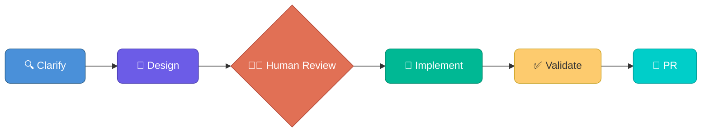

> **Disclaimer:** These workflows are intended for delivery via RTS (Resident Technical Services) as part of a Professional Services engagement. This repository should not be handed over without guided enablement — agentic infrastructure development requires mature IaC practices, layered guardrails, and operational readiness. Without these foundations, autonomous code generation against live infrastructure carries significant risk. Adoption and customization should be guided by a Resident Solutions Architect to ensure alignment with your organization's security posture, operational standards, and infrastructure maturity.
>
> **Get Started:** Engage via the **Lighthouse program** or reach out to **Fiona Black** directly.
> For technical guidance or queries reach out to **Simon Lynch** or **Aaron Evans**.

# Terraform Agentic Workflows

[](LICENSE)
[](https://www.terraform.io/)

A framework for agentic Infrastructure as Code development workflows using **Spec-Driven Development (SDD)** — a structured approach that guides AI agents through building production-ready Terraform code with guardrails at every phase. Built on industry standards like [agent skills](https://agentskills.io/) and subagents, this framework is designed to be generic and can be customized to work with any AI coding harness that supports these primitives. This fork includes a native **IBM Bob** adapter alongside the existing Claude Code and GitHub Copilot CLI integrations. See [IBM Bob usage](docs/ibm-bob.md).

> **Guardrails matter.** Agentic AI for critical infrastructure requires mature IaC practices and strong operational guardrails to deliver successful outcomes. **HCP Terraform** is a key component of this approach — providing remote execution, policy enforcement, state management, and approval workflows that keep AI-generated infrastructure safe and auditable.
>
> 
>
> **Note:** This repository is a framework for agentic development workflows for Infrastructure as Code. Customization to a customer's specific requirements, security posture, and best practices should be undertaken as a Resident Solutions Architect (RSA) engagement.
>
> **Learn more:** Visit [AI-Powered Infrastructure Engineering at Enterprise Scale](https://pages.github.ibm.com/AdvArch/tfai/) — a structured learning path for platform teams adopting autonomous HCP Terraform development, covering agent architecture, layered guardrails, Specification-Driven Development, and three validated workflow patterns.

## What is this?

This repository is a development template, not a deployed module. It provides orchestrated AI agent workflows for three core Terraform use cases, each following the same structure:



- **Clarify** — Gather requirements, resolve ambiguity, research AWS/provider docs
- **Design** — Produce a design document with architecture, interfaces, security controls
- **Human Review** — Approve the design before any code is written
- **Implement** — TDD: write tests first, then build to pass them
- **Validate** — Run the full quality pipeline (fmt, validate, test, tflint, trivy, docs)
- **PR** — Create a pull request with the implementation for final review

**Why use this?** Writing production-grade Terraform by hand is slow and error-prone — security defaults get missed, tests are skipped, documentation drifts. SDD with AI agents enforces quality at every phase, producing consistent, tested, documented infrastructure code in a fraction of the time.

**Can't I build my own workflows?** Yes — and many teams do. But getting agentic IaC right is harder than it looks. Naive prompting produces code that works in demos but fails in production: no tests, no security defaults, inconsistent structure, and no guardrails to prevent drift. This framework encodes months of iteration into reusable skills, constitutions, and validation pipelines. You get a proven starting point instead of rebuilding the same lessons from scratch — and because it's built on open standards (agent skills, subagents, MCP), you can extend and customize it rather than being locked in.

**Are these workflows designed to run in the IDE?** These workflows are designed for long-running, background agentic execution — not quick inline completions. We recommend starting in the IDE (VS Code devcontainer) as the fastest path to adoption. As practices mature, these same workflows can be centralized in cloud agent sandboxes such as [AWS AgentCore](https://aws.amazon.com/bedrock/agentcore/), decoupling execution from individual developer machines, enabling platform-level orchestration, and unlocking dynamic secrets management for coding agent harnesses.

## Quick Start

**Prerequisites:** Docker Desktop, VS Code, GitHub fine-grained PAT, HCP Terraform Team API token, and either a **Claude Code** subscription or **GitHub Copilot** license.

```bash
# 1. Create a new repo from this template on GitHub, then clone it
git clone https://github.com/YOUR_ORG/your-new-repo.git
code your-new-repo

# 2. When VS Code prompts, click "Reopen in Container"
#    Choose claude-code or copilot-cli variant depending on your AI assistant

# 3. Validate your environment
bash .foundations/scripts/bash/validate-env.sh
```

All other tools (Terraform, TFLint, terraform-docs, Trivy, Go, GitHub CLI, and more) are pre-installed in the devcontainer.

See the **[Getting Started Guide](docs/getting_started.md)** for complete setup instructions including token configuration and branch protection.

## Core Workflows

Start any workflow by typing the slash command in your AI assistant's chat (Claude Code terminal or Copilot Chat). The same slash commands work in both tools:

| Workflow | Purpose | Plan & Design | Implement & Validate |
|----------|---------|----------------|----------------------|
| **Module Authoring** | Create reusable Terraform modules with direct provider resources and secure defaults | `/tf-module-plan` | `/tf-module-implement` |
| **Provider Development** | Build Terraform Provider resources using the Plugin Framework | `/tf-provider-plan` | `/tf-provider-implement` |
| **Consumer Provisioning** | Compose infrastructure from private registry modules | `/tf-consumer-plan` | `/tf-consumer-implement` |

## Day 2 Operations

| Workflow | Purpose | Trigger | Agent |
|----------|---------|---------|-------|
| **Consumer Module Uplift** | Automated module version upgrades with risk assessment, remediation, and post-merge apply | Dependabot PR | `module-upgrade-remediation` |

The **consumer module uplift** pipeline automates dependency management for consumer configurations:

1. **Dependabot** detects new module versions in the private registry
2. **GitHub Actions** classifies the version bump, runs `terraform plan`, and assesses risk
3. **Low-risk changes** (patch, adds-only) are auto-merged
4. **Breaking changes** trigger `@claude` — an AI agent that fetches the old/new module interfaces, fixes consumer code, and pushes the fix for re-validation

See [Day 2 Operations](docs/getting_started.md#day-2-operations--consumer-module-uplift) for full details.

## MCP Servers

Pre-configured [Model Context Protocol](https://modelcontextprotocol.io/) servers extend AI agent capabilities:

| Server | Description |
|--------|-------------|
| `terraform` | HCP Terraform — workspace management, run execution, registry lookups, variable management |
| `aws-documentation-mcp-server` | AWS documentation search, best practices, service recommendations |

Configured in `.mcp.json` and available automatically in the devcontainer.

## What's Included

- **Devcontainer** — Assistant variants for `ibm-bob`, `claude-code` (Claude Code CLI), and `copilot-cli` (GitHub Copilot); Claude and Copilot also include rootless-Podman variants (`*-podman`). They ship the Terraform development, validation, security, and documentation toolchain.
- **Pre-commit hooks** — fmt, validate, docs, tflint, trivy, secret detection, Vault Radar (requires optional `VAULT_RADAR_LICENSE`)
- **TFLint** — AWS (0.46.0), Azure (0.31.1), and Terraform plugins with all 20 rules configured
- **Constitutions** — Non-negotiable rules for module, provider, and consumer code generation
- **Design templates** — Canonical starting points for each workflow's design phase
- **CI/CD pipelines** — Validation, apply, release, and consumer uplift workflows

## Documentation

| Resource | Description |
|----------|-------------|
| [Getting Started](docs/getting_started.md) | Environment setup and first workflow |
| [Documentation Site](docs/index.html) | Full reference site (open locally in browser — not rendered on GitHub) |
| [AGENTS.md](AGENTS.md) | Agent inventory, skills, and context management rules |

## Validated Models

This solution has been validated with the following models (listed in order of observed performance):

| Rank | Model | Provider |
|------|-------|----------|
| 1 | Opus 4.6 | Anthropic |
| 2 | ChatGPT 5.4 | OpenAI |
| 3 | Gemini 3 Pro | Google |

Model choice is up to customer preference — all three produce production-quality output. Evals generally show best results in the order above.

## Contributing

Contributions are welcome. Please open an issue to discuss proposed changes before submitting a pull request.

## License

This project is licensed under the [Apache License 2.0](LICENSE).

<!-- BEGIN_TF_DOCS -->
## Requirements

| Name | Version |
| ---- | ------- |
| <a name="requirement_terraform"></a> [terraform](#requirement\_terraform) | >= 1.7 |
| <a name="requirement_aws"></a> [aws](#requirement\_aws) | >= 5.0 |

## Providers

| Name | Version |
| ---- | ------- |
| <a name="provider_aws"></a> [aws](#provider\_aws) | 6.54.0 |

## Modules

| Name | Source | Version |
| ---- | ------ | ------- |
| <a name="module_eks"></a> [eks](#module\_eks) | app.terraform.io/jose-merchan/eks/aws | 0.0.0 |
| <a name="module_vpc"></a> [vpc](#module\_vpc) | app.terraform.io/jose-merchan/vpc/aws | 0.0.0 |

## Resources

| Name | Type |
| ---- | ---- |
| [aws_availability_zones.available](https://registry.terraform.io/providers/hashicorp/aws/latest/docs/data-sources/availability_zones) | data source |

## Inputs

| Name | Description | Type | Default | Required |
| ---- | ----------- | ---- | ------- | :------: |
| <a name="input_authentication_mode"></a> [authentication\_mode](#input\_authentication\_mode) | EKS cluster authentication mode. API\_AND\_CONFIG\_MAP supports both EKS access entries and the legacy aws-auth ConfigMap. | `string` | `"API_AND_CONFIG_MAP"` | no |
| <a name="input_availability_zones"></a> [availability\_zones](#input\_availability\_zones) | Availability zones for subnet creation. Auto-discovered from AWS when empty. Minimum two required by EKS. | `list(string)` | `[]` | no |
| <a name="input_cluster_endpoint_public_access"></a> [cluster\_endpoint\_public\_access](#input\_cluster\_endpoint\_public\_access) | Whether the EKS API server endpoint is reachable from the public internet. Defaults to false (Security Hub EKS.1). | `bool` | `false` | no |
| <a name="input_cluster_endpoint_public_access_cidrs"></a> [cluster\_endpoint\_public\_access\_cidrs](#input\_cluster\_endpoint\_public\_access\_cidrs) | CIDR blocks allowed to reach the public endpoint. Only applies when cluster\_endpoint\_public\_access = true. Should be restricted to known CIDRs in production. | `list(string)` | <pre>[<br/>  "0.0.0.0/0"<br/>]</pre> | no |
| <a name="input_cluster_log_retention_in_days"></a> [cluster\_log\_retention\_in\_days](#input\_cluster\_log\_retention\_in\_days) | CloudWatch log group retention in days. Must be a valid CloudWatch retention value. | `number` | `90` | no |
| <a name="input_cluster_log_types"></a> [cluster\_log\_types](#input\_cluster\_log\_types) | Control plane log types to send to CloudWatch. Defaults to all five types (Security Hub EKS.8). | `list(string)` | <pre>[<br/>  "api",<br/>  "audit",<br/>  "authenticator",<br/>  "controllerManager",<br/>  "scheduler"<br/>]</pre> | no |
| <a name="input_cluster_name"></a> [cluster\_name](#input\_cluster\_name) | Name of the EKS cluster. Must be 1-100 characters, alphanumeric, hyphens, or underscores. | `string` | n/a | yes |
| <a name="input_enable_irsa"></a> [enable\_irsa](#input\_enable\_irsa) | Enable the OIDC provider for IAM Roles for Service Accounts (IRSA). Defaults to true. | `bool` | `true` | no |
| <a name="input_enable_vpc_flow_logs"></a> [enable\_vpc\_flow\_logs](#input\_enable\_vpc\_flow\_logs) | Enable VPC Flow Logs for the created VPC. Recommended for production environments. | `bool` | `false` | no |
| <a name="input_environment"></a> [environment](#input\_environment) | Environment identifier applied to all resource tags (e.g. "dev", "staging", "prod", "sandbox"). | `string` | n/a | yes |
| <a name="input_kms_key_enabled"></a> [kms\_key\_enabled](#input\_kms\_key\_enabled) | Create and attach a customer-managed KMS key for Kubernetes secrets envelope encryption. Defaults to true (Security Hub EKS.3). | `bool` | `true` | no |
| <a name="input_kubernetes_version"></a> [kubernetes\_version](#input\_kubernetes\_version) | Kubernetes version for the EKS cluster control plane (e.g. "1.32"). Must be MAJOR.MINOR format. | `string` | n/a | yes |
| <a name="input_node_capacity_type"></a> [node\_capacity\_type](#input\_node\_capacity\_type) | Node group capacity type. ON\_DEMAND provides consistent availability; SPOT reduces cost with interruption risk. | `string` | `"ON_DEMAND"` | no |
| <a name="input_node_desired_size"></a> [node\_desired\_size](#input\_node\_desired\_size) | Desired number of worker nodes at cluster creation. Must be between node\_min\_size and node\_max\_size. | `number` | n/a | yes |
| <a name="input_node_disk_size"></a> [node\_disk\_size](#input\_node\_disk\_size) | EBS root volume size in GiB for worker nodes. | `number` | `20` | no |
| <a name="input_node_instance_types"></a> [node\_instance\_types](#input\_node\_instance\_types) | List of EC2 instance types for the managed node group (e.g. ["t3.medium"]). | `list(string)` | n/a | yes |
| <a name="input_node_max_size"></a> [node\_max\_size](#input\_node\_max\_size) | Maximum number of worker nodes in the managed node group. Must be >= node\_min\_size. | `number` | n/a | yes |
| <a name="input_node_min_size"></a> [node\_min\_size](#input\_node\_min\_size) | Minimum number of worker nodes in the managed node group. | `number` | n/a | yes |
| <a name="input_one_nat_gateway_per_az"></a> [one\_nat\_gateway\_per\_az](#input\_one\_nat\_gateway\_per\_az) | When true, one NAT gateway is created per AZ (high availability). When false, a single shared NAT gateway is used (cost saving). | `bool` | `false` | no |
| <a name="input_private_subnet_cidrs"></a> [private\_subnet\_cidrs](#input\_private\_subnet\_cidrs) | CIDR blocks for private subnets, one per availability zone. /20 or larger recommended for node and pod IP allocation. | `list(string)` | <pre>[<br/>  "10.0.1.0/24",<br/>  "10.0.2.0/24"<br/>]</pre> | no |
| <a name="input_private_subnet_ids"></a> [private\_subnet\_ids](#input\_private\_subnet\_ids) | IDs of existing private subnets for worker nodes. Required when vpc\_id is provided; ignored when creating a new VPC. | `list(string)` | `[]` | no |
| <a name="input_public_subnet_cidrs"></a> [public\_subnet\_cidrs](#input\_public\_subnet\_cidrs) | CIDR blocks for public subnets, one per availability zone. Only used when creating a new VPC. | `list(string)` | <pre>[<br/>  "10.0.101.0/24",<br/>  "10.0.102.0/24"<br/>]</pre> | no |
| <a name="input_public_subnet_ids"></a> [public\_subnet\_ids](#input\_public\_subnet\_ids) | IDs of existing public subnets for load balancer ENIs. Required when vpc\_id is provided; ignored when creating a new VPC. | `list(string)` | `[]` | no |
| <a name="input_tags"></a> [tags](#input\_tags) | Additional tags merged onto all taggable resources. Consumer-provided tags take precedence over module defaults. | `map(string)` | `{}` | no |
| <a name="input_vpc_cidr"></a> [vpc\_cidr](#input\_vpc\_cidr) | CIDR block for the new VPC. Only used when vpc\_id is not provided. | `string` | `"10.0.0.0/16"` | no |
| <a name="input_vpc_id"></a> [vpc\_id](#input\_vpc\_id) | ID of an existing VPC to use. When null or empty string, a new VPC is created automatically. | `string` | `null` | no |

## Outputs

| Name | Description |
| ---- | ----------- |
| <a name="output_cloudwatch_log_group_name"></a> [cloudwatch\_log\_group\_name](#output\_cloudwatch\_log\_group\_name) | Name of the CloudWatch log group for EKS control plane logs. |
| <a name="output_cluster_arn"></a> [cluster\_arn](#output\_cluster\_arn) | ARN of the EKS cluster. |
| <a name="output_cluster_certificate_authority_data"></a> [cluster\_certificate\_authority\_data](#output\_cluster\_certificate\_authority\_data) | Base64-encoded certificate authority data required for kubeconfig generation. |
| <a name="output_cluster_endpoint"></a> [cluster\_endpoint](#output\_cluster\_endpoint) | URL of the EKS API server endpoint. |
| <a name="output_cluster_iam_role_arn"></a> [cluster\_iam\_role\_arn](#output\_cluster\_iam\_role\_arn) | ARN of the IAM role attached to the EKS control plane. |
| <a name="output_cluster_name"></a> [cluster\_name](#output\_cluster\_name) | Name of the EKS cluster. |
| <a name="output_cluster_oidc_issuer_url"></a> [cluster\_oidc\_issuer\_url](#output\_cluster\_oidc\_issuer\_url) | OIDC issuer URL for configuring IAM Roles for Service Accounts (IRSA). |
| <a name="output_cluster_security_group_id"></a> [cluster\_security\_group\_id](#output\_cluster\_security\_group\_id) | ID of the cluster security group created by EKS. |
| <a name="output_node_iam_role_arn"></a> [node\_iam\_role\_arn](#output\_node\_iam\_role\_arn) | ARN of the IAM role attached to EKS managed nodes. |
| <a name="output_node_security_group_id"></a> [node\_security\_group\_id](#output\_node\_security\_group\_id) | ID of the shared node security group. |
| <a name="output_oidc_provider_arn"></a> [oidc\_provider\_arn](#output\_oidc\_provider\_arn) | ARN of the OIDC identity provider — used to create IRSA IAM role trust policies. |
| <a name="output_private_subnet_ids"></a> [private\_subnet\_ids](#output\_private\_subnet\_ids) | IDs of the private subnets used by worker nodes. |
| <a name="output_public_subnet_ids"></a> [public\_subnet\_ids](#output\_public\_subnet\_ids) | IDs of the public subnets used by load balancer ENIs. |
| <a name="output_vpc_id"></a> [vpc\_id](#output\_vpc\_id) | ID of the VPC used by the EKS cluster (created or provided). |
<!-- END_TF_DOCS -->